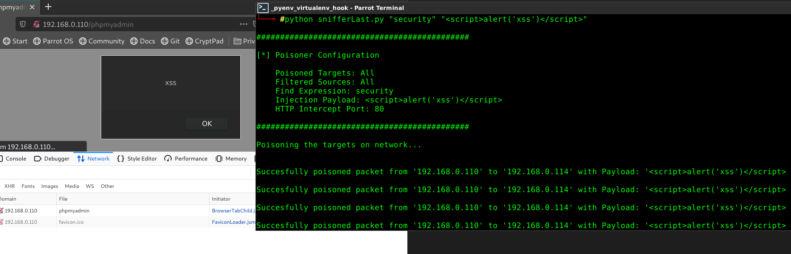

# HttpPoisoner
Http Requests Poisoner using MITM 

This Python script intercepts http network traffic using iptables and nfqueue and replaces a regular <br>expression found in request with a string.

```
usage: HttpPoisoner.py [-h] [-t TARGETS] [-s SOURCES] [-p PORT] [-q] find_exp replace_exp

positional arguments:
  find_exp              Regular expression to find inside the request (Example: "Why python.*?[\?\.\!]")
  replace_exp           Regular expression replacement payload for find_exp (Example: "BECAUSE!")

optional arguments:
  -h, --help                       show this help message and exit
  -t TARGETS, --targets TARGETS    Filter the targets of the payload injected request (Default: All)
  -s SOURCES, --sources SOURCES    Filter the sources of initiated requests (Default: All)
  -p PORT, --port PORT             Custom HTTP port to intercept (Default: 80)
  -q, --quiet                      Disable terminal logging verbosity (Default: disabled)
```

**Example Usage:**

HttpPoisoner.py "security" "\<script>alert('xss');\</script>\"  
**In this case, it intercepts all http trafic on default port 80 and replaces the occurence of <br> "security" with the xss payload**




### *Caution*
*This program requires root priviledges to run. It uses iptables forwarding rules to intercept and forward<br> crafted packets so in case the script execution was interrupted abnormally then it is required to flush <br>the iptables manually using the command below:*

```
iptables -t raw -F
```
